# overview
- 设定规则：创建一个zodiac规则，该规则限制某个多签合约每次只能从safe合约转出0.0001个usdt
- polygon链为例
## architecture 
- zodiac和safe的关系图
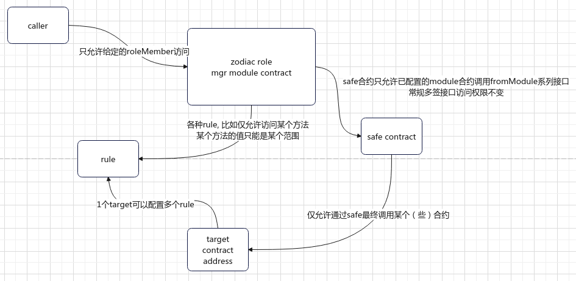
- 该规则的系统设计图
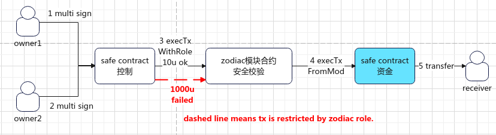
## reference
- refer to [有道云笔记](https://note.youdao.com/s/B7oP16QZ)
## steps
- 1 创建受限制的多签合约， 通过这个多签合约来从资金合约里转出资金
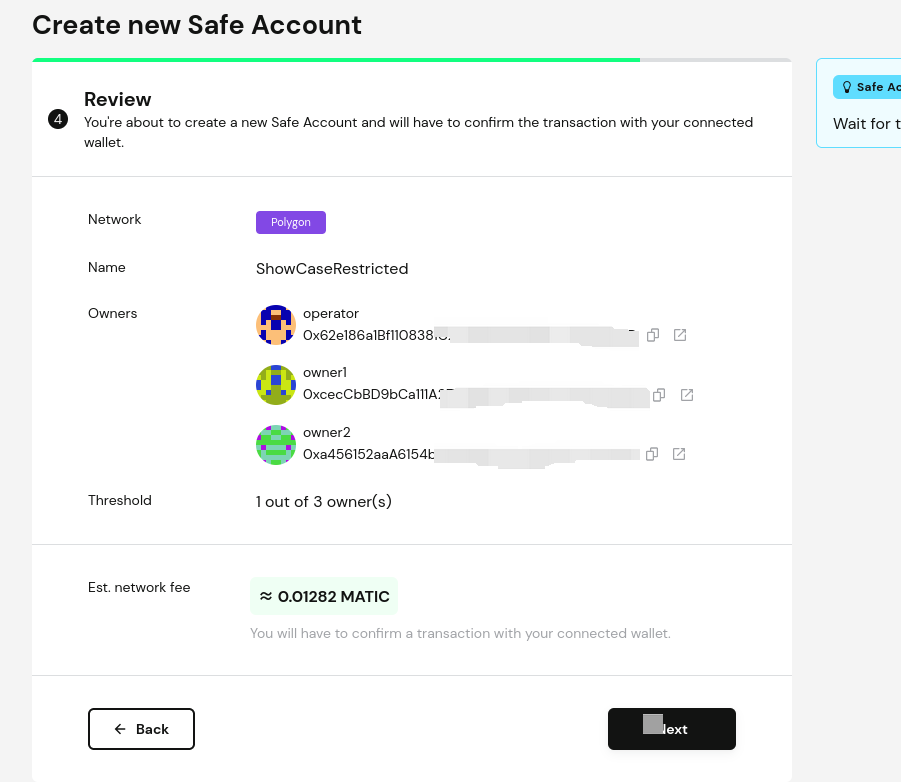

- 2 创建资金多签合约，实际存储资金
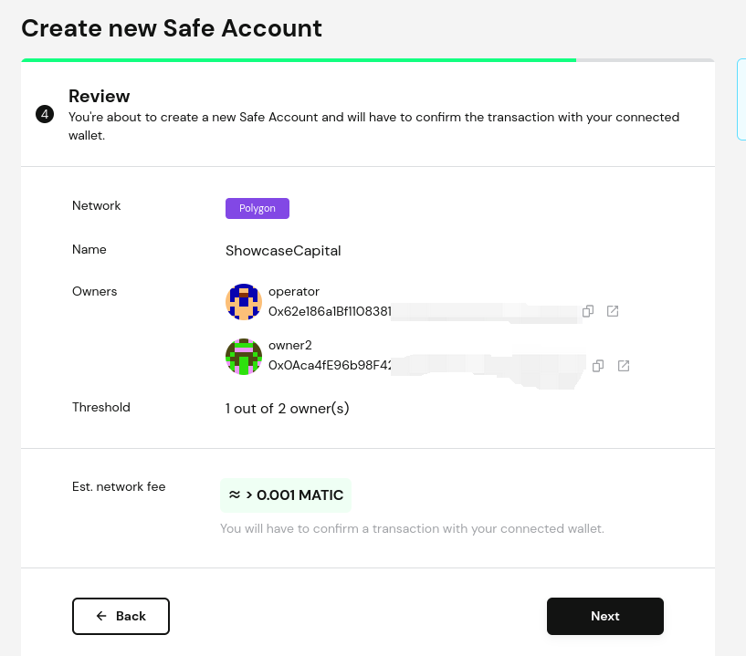
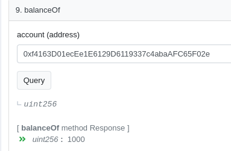
- 3 给资金合约转入一定量的u（0.001）
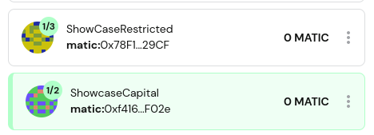
- 4 创建ZodiacRoleModifier合约
  - 点击左侧apps， 选择zodiac合约，点击进入
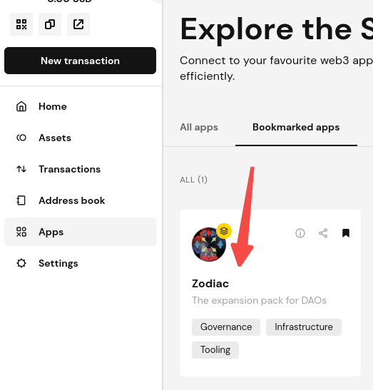
  - 选择Roles Modifier
  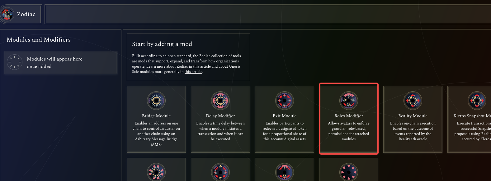
  - 使用2个默认值创建module合约
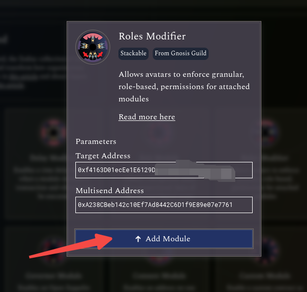
  - 确认并执行多签交易
  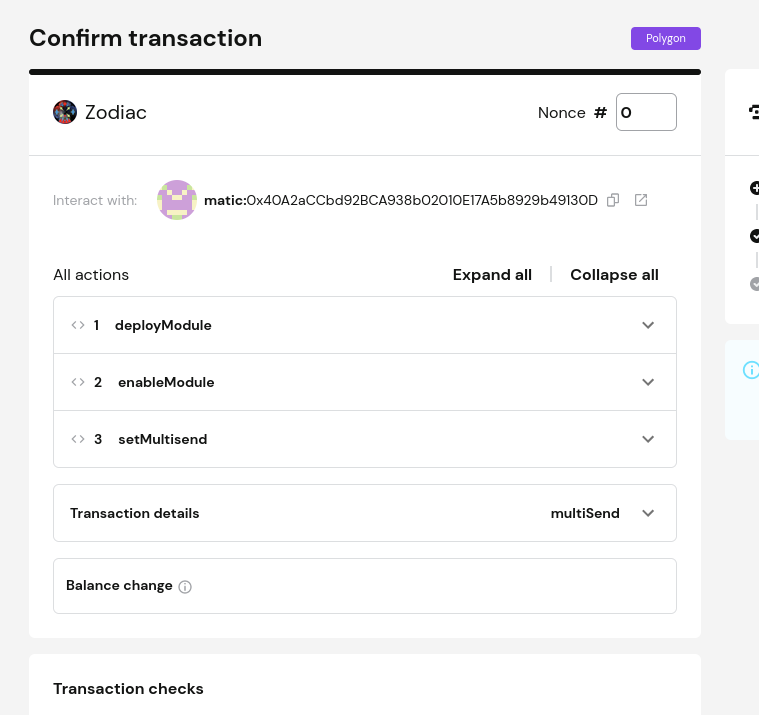
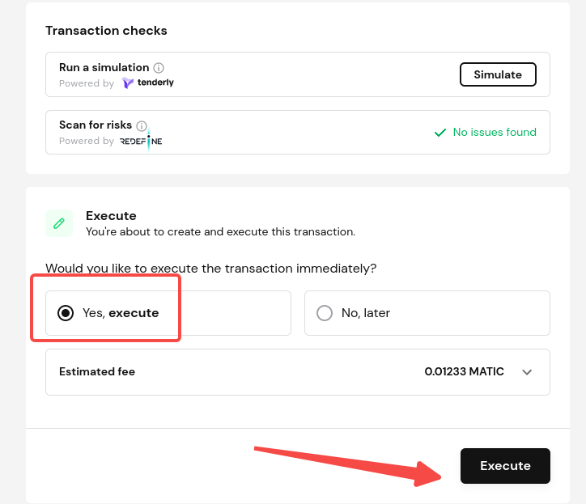

  - 等待多签交易执行
  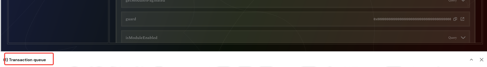
- 5 创建role, 并初始化规则
  - 点击edit roles, 创建role

  - 点击createRole
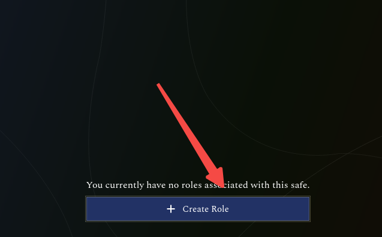
  - 点击Add a member, 填写ShowcaseStricted多签合约地址
  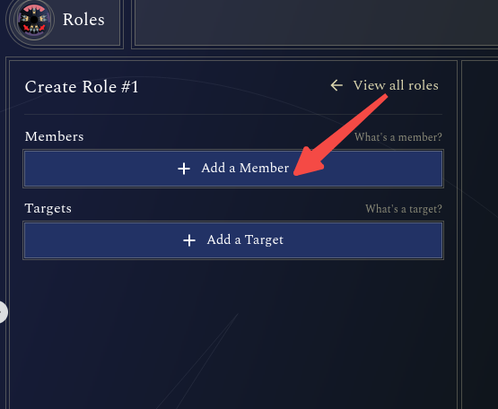
  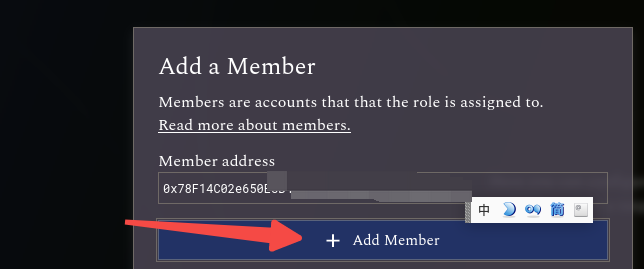
  - 点击Add a target, 填写usdt合约地址，不勾选"allow sending ether" 和 "allow delegate call"
  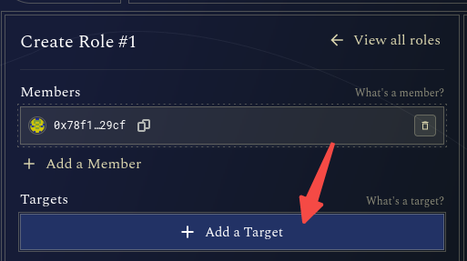
  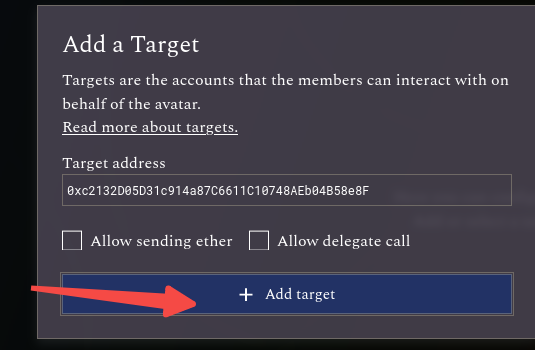
  - 如果无法自动获取到usdt的abi, 就从polygonscan.com里搜索到usdt的abi， 或者直接复制下面的abi, 然后点击submit custom abi
  `[{"inputs":[],"stateMutability":"nonpayable","type":"constructor"},{"anonymous":false,"inputs":[{"indexed":true,"internalType":"address","name":"owner","type":"address"},{"indexed":true,"internalType":"address","name":"spender","type":"address"},{"indexed":false,"internalType":"uint256","name":"value","type":"uint256"}],"name":"Approval","type":"event"},{"anonymous":false,"inputs":[{"indexed":false,"internalType":"address","name":"userAddress","type":"address"},{"indexed":false,"internalType":"address payable","name":"relayerAddress","type":"address"},{"indexed":false,"internalType":"bytes","name":"functionSignature","type":"bytes"}],"name":"MetaTransactionExecuted","type":"event"},{"anonymous":false,"inputs":[{"indexed":true,"internalType":"bytes32","name":"role","type":"bytes32"},{"indexed":true,"internalType":"bytes32","name":"previousAdminRole","type":"bytes32"},{"indexed":true,"internalType":"bytes32","name":"newAdminRole","type":"bytes32"}],"name":"RoleAdminChanged","type":"event"},{"anonymous":false,"inputs":[{"indexed":true,"internalType":"bytes32","name":"role","type":"bytes32"},{"indexed":true,"internalType":"address","name":"account","type":"address"},{"indexed":true,"internalType":"address","name":"sender","type":"address"}],"name":"RoleGranted","type":"event"},{"anonymous":false,"inputs":[{"indexed":true,"internalType":"bytes32","name":"role","type":"bytes32"},{"indexed":true,"internalType":"address","name":"account","type":"address"},{"indexed":true,"internalType":"address","name":"sender","type":"address"}],"name":"RoleRevoked","type":"event"},{"anonymous":false,"inputs":[{"indexed":true,"internalType":"address","name":"from","type":"address"},{"indexed":true,"internalType":"address","name":"to","type":"address"},{"indexed":false,"internalType":"uint256","name":"value","type":"uint256"}],"name":"Transfer","type":"event"},{"inputs":[],"name":"CHILD_CHAIN_ID","outputs":[{"internalType":"uint256","name":"","type":"uint256"}],"stateMutability":"view","type":"function"},{"inputs":[],"name":"CHILD_CHAIN_ID_BYTES","outputs":[{"internalType":"bytes","name":"","type":"bytes"}],"stateMutability":"view","type":"function"},{"inputs":[],"name":"DEFAULT_ADMIN_ROLE","outputs":[{"internalType":"bytes32","name":"","type":"bytes32"}],"stateMutability":"view","type":"function"},{"inputs":[],"name":"DEPOSITOR_ROLE","outputs":[{"internalType":"bytes32","name":"","type":"bytes32"}],"stateMutability":"view","type":"function"},{"inputs":[],"name":"ERC712_VERSION","outputs":[{"internalType":"string","name":"","type":"string"}],"stateMutability":"view","type":"function"},{"inputs":[],"name":"ROOT_CHAIN_ID","outputs":[{"internalType":"uint256","name":"","type":"uint256"}],"stateMutability":"view","type":"function"},{"inputs":[],"name":"ROOT_CHAIN_ID_BYTES","outputs":[{"internalType":"bytes","name":"","type":"bytes"}],"stateMutability":"view","type":"function"},{"inputs":[{"internalType":"address","name":"owner","type":"address"},{"internalType":"address","name":"spender","type":"address"}],"name":"allowance","outputs":[{"internalType":"uint256","name":"","type":"uint256"}],"stateMutability":"view","type":"function"},{"inputs":[{"internalType":"address","name":"spender","type":"address"},{"internalType":"uint256","name":"amount","type":"uint256"}],"name":"approve","outputs":[{"internalType":"bool","name":"","type":"bool"}],"stateMutability":"nonpayable","type":"function"},{"inputs":[{"internalType":"address","name":"account","type":"address"}],"name":"balanceOf","outputs":[{"internalType":"uint256","name":"","type":"uint256"}],"stateMutability":"view","type":"function"},{"inputs":[{"internalType":"string","name":"name_","type":"string"}],"name":"changeName","outputs":[],"stateMutability":"nonpayable","type":"function"},{"inputs":[],"name":"decimals","outputs":[{"internalType":"uint8","name":"","type":"uint8"}],"stateMutability":"view","type":"function"},{"inputs":[{"internalType":"address","name":"spender","type":"address"},{"internalType":"uint256","name":"subtractedValue","type":"uint256"}],"name":"decreaseAllowance","outputs":[{"internalType":"bool","name":"","type":"bool"}],"stateMutability":"nonpayable","type":"function"},{"inputs":[{"internalType":"address","name":"user","type":"address"},{"internalType":"bytes","name":"depositData","type":"bytes"}],"name":"deposit","outputs":[],"stateMutability":"nonpayable","type":"function"},{"inputs":[{"internalType":"address","name":"userAddress","type":"address"},{"internalType":"bytes","name":"functionSignature","type":"bytes"},{"internalType":"bytes32","name":"sigR","type":"bytes32"},{"internalType":"bytes32","name":"sigS","type":"bytes32"},{"internalType":"uint8","name":"sigV","type":"uint8"}],"name":"executeMetaTransaction","outputs":[{"internalType":"bytes","name":"","type":"bytes"}],"stateMutability":"payable","type":"function"},{"inputs":[],"name":"getChainId","outputs":[{"internalType":"uint256","name":"","type":"uint256"}],"stateMutability":"pure","type":"function"},{"inputs":[],"name":"getDomainSeperator","outputs":[{"internalType":"bytes32","name":"","type":"bytes32"}],"stateMutability":"view","type":"function"},{"inputs":[{"internalType":"address","name":"user","type":"address"}],"name":"getNonce","outputs":[{"internalType":"uint256","name":"nonce","type":"uint256"}],"stateMutability":"view","type":"function"},{"inputs":[{"internalType":"bytes32","name":"role","type":"bytes32"}],"name":"getRoleAdmin","outputs":[{"internalType":"bytes32","name":"","type":"bytes32"}],"stateMutability":"view","type":"function"},{"inputs":[{"internalType":"bytes32","name":"role","type":"bytes32"},{"internalType":"uint256","name":"index","type":"uint256"}],"name":"getRoleMember","outputs":[{"internalType":"address","name":"","type":"address"}],"stateMutability":"view","type":"function"},{"inputs":[{"internalType":"bytes32","name":"role","type":"bytes32"}],"name":"getRoleMemberCount","outputs":[{"internalType":"uint256","name":"","type":"uint256"}],"stateMutability":"view","type":"function"},{"inputs":[{"internalType":"bytes32","name":"role","type":"bytes32"},{"internalType":"address","name":"account","type":"address"}],"name":"grantRole","outputs":[],"stateMutability":"nonpayable","type":"function"},{"inputs":[{"internalType":"bytes32","name":"role","type":"bytes32"},{"internalType":"address","name":"account","type":"address"}],"name":"hasRole","outputs":[{"internalType":"bool","name":"","type":"bool"}],"stateMutability":"view","type":"function"},{"inputs":[{"internalType":"address","name":"spender","type":"address"},{"internalType":"uint256","name":"addedValue","type":"uint256"}],"name":"increaseAllowance","outputs":[{"internalType":"bool","name":"","type":"bool"}],"stateMutability":"nonpayable","type":"function"},{"inputs":[{"internalType":"string","name":"name_","type":"string"},{"internalType":"string","name":"symbol_","type":"string"},{"internalType":"uint8","name":"decimals_","type":"uint8"},{"internalType":"address","name":"childChainManager","type":"address"}],"name":"initialize","outputs":[],"stateMutability":"nonpayable","type":"function"},{"inputs":[],"name":"name","outputs":[{"internalType":"string","name":"","type":"string"}],"stateMutability":"view","type":"function"},{"inputs":[{"internalType":"bytes32","name":"role","type":"bytes32"},{"internalType":"address","name":"account","type":"address"}],"name":"renounceRole","outputs":[],"stateMutability":"nonpayable","type":"function"},{"inputs":[{"internalType":"bytes32","name":"role","type":"bytes32"},{"internalType":"address","name":"account","type":"address"}],"name":"revokeRole","outputs":[],"stateMutability":"nonpayable","type":"function"},{"inputs":[],"name":"symbol","outputs":[{"internalType":"string","name":"","type":"string"}],"stateMutability":"view","type":"function"},{"inputs":[],"name":"totalSupply","outputs":[{"internalType":"uint256","name":"","type":"uint256"}],"stateMutability":"view","type":"function"},{"inputs":[{"internalType":"address","name":"recipient","type":"address"},{"internalType":"uint256","name":"amount","type":"uint256"}],"name":"transfer","outputs":[{"internalType":"bool","name":"","type":"bool"}],"stateMutability":"nonpayable","type":"function"},{"inputs":[{"internalType":"address","name":"sender","type":"address"},{"internalType":"address","name":"recipient","type":"address"},{"internalType":"uint256","name":"amount","type":"uint256"}],"name":"transferFrom","outputs":[{"internalType":"bool","name":"","type":"bool"}],"stateMutability":"nonpayable","type":"function"},{"inputs":[{"internalType":"uint256","name":"amount","type":"uint256"}],"name":"withdraw","outputs":[],"stateMutability":"nonpayable","type":"function"}]`
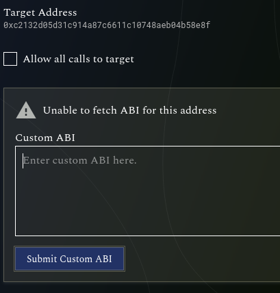
  - 找到transfer方法，在amount(uint256)字符旁边，点击“add a condition"
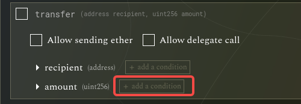
  - 保持 is equal to的条件，输入10， 点击create role
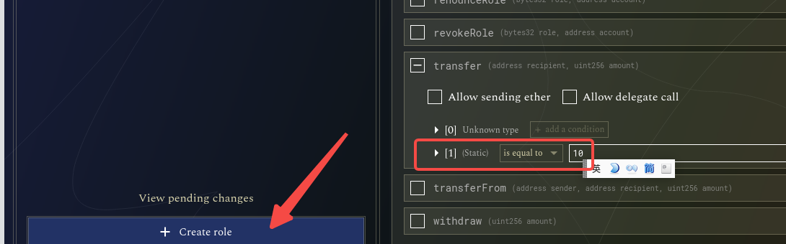
  - 完成多签
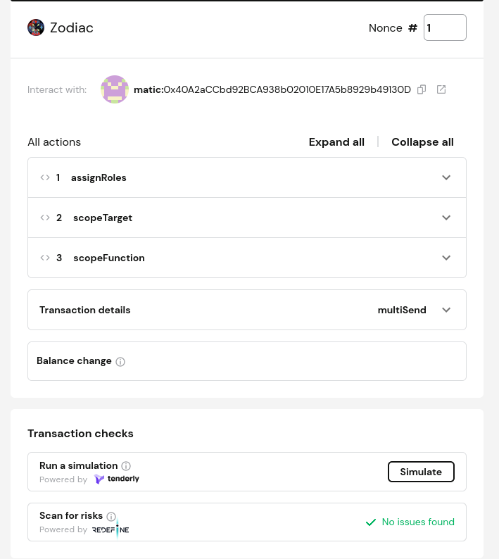
- 6 更新为目标规则
  - 点击editRole
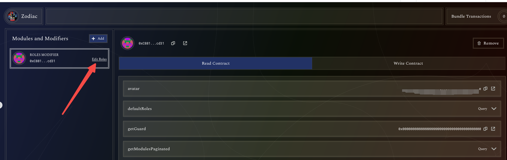
  - edit role1
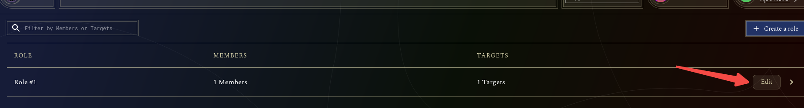
  - 点击target的合约，把右侧的transfer amount改为 less than, 数量填10
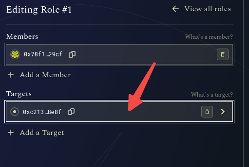
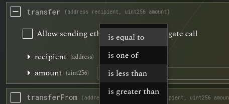
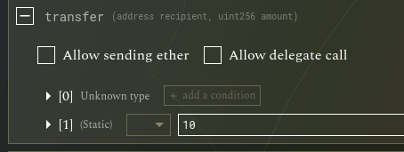
  - 完成并等待多签
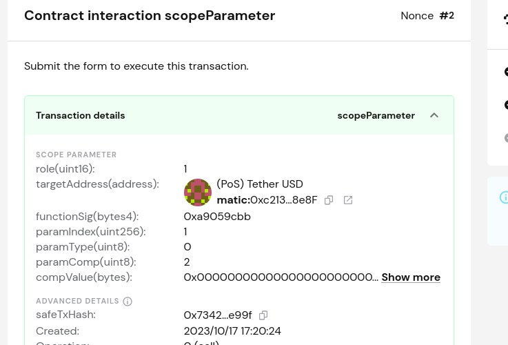

- 7 重新进入zodiac roles modifier界面，确认规则设置生效
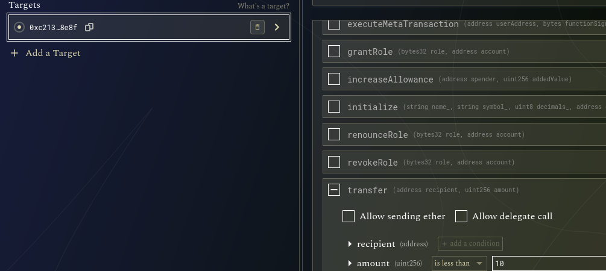
