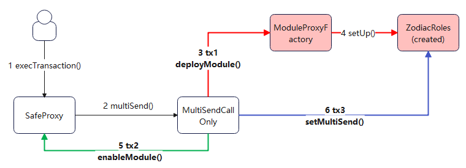
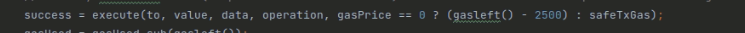

# overview
- 目的：给f02e的safe多签合约绑定一个zodiac模块合约，并进行规则设置。
- 简介：在整个zodiac合约创建和规则绑定过程中，有3次重要的交易，
- 手动操作见上一篇   [safe钱包zodiac合约创建和规则绑定](../web2Workflow/HowToCreateZodiacContract.md)
## reference
- refer to [有道云笔记](https://note.youdao.com/s/9UHRhAM0)
# questions
- 1 在web2上操作了addModule按钮，发生了什么？，以及web2上的addRule和updateRule的按钮被点击之后，发生了什么？
- 2 safe如何做到在一个交易里，完成多个函数调用？它的calldata的每一部分是如何构成的？
- 3 safe web2如何解析出来一个multiSend操作里有哪些交易？以及这些交易中，safeWeb2是如何识别出对应的函数调用信息？
# total3Txs
- zodiac合约创建 + 规则设置
# steps 
## 创建zodiac合约
- 主流程描述：发送请求给moduleProxyFactory, 请求创建一个safe的module, 并进行module的初始化和在资金safe中激活该module。
- web2操作：点击addModule按钮，并执行多签交易
- safe交易详情截图：
- 数据流简图：
### 亮点
#### safe合约钱包本身亮点——支持gas代付：
- 像aa钱包一样，携带了gas代付特性
- 执行多签交易时，会对签名做如下重点校验。 
  - 管理员签名是否足够
  - 管理员的签名是否是对应的该交易
- 即交易执行过程中，可以不由管理员支付gas，而是第三方进行统一提交和支付

#### multiSend合约的设计——一笔链上交易，包含多个自定义safe子交易：
- 调用者序列化参数列表，类似于多个（header+dataLength+data）交易信息，通过这种方式来将多笔交易合为一个
  - 节省gas费用（1笔交易）
- 有一个不太明白的点，什么场景下会只能用multiSendCallOnly合约，而不能用multiSend合约？

#### safe合约的执行时的delegatecall选项使用：
- 允许通过第三方合约逻辑来让safe合约执行一些交易(delegatecall)
  - 比如需要通过multiSend等第三方合约进行批量操作时，就需要让safe合约的方法进行delegatecall，因为实际发生交易的仍然是safe合约，multiSend合约只是提供了一个组装方法(stack together)

#### create2指令创建合约：
- 和原来的create指令相比，通过给定salt参数，能明确得到创建出的新合约地址
- 有兴趣的话可以了解一下ModuleProxyFactory的createProxy方法，里面对deployment合约内容的头尾添加了一定的evm code

#### initializer字节流的使用：
- 当合约创建出来之后，通过assembly直接call, 相当于一个post contract created的钩子，调用该函数来对创建出来的合约进行初始化。
  - 配合创建合约使用
- safe合约代码里大量使用了此类实现

### 链上交易（1笔）：
hash: https://polygonscan.com/tx/0xc1967a7f61e4d2cf13a93aa54d8d2f1762c8b28e0576228b8792e0f5ab00b657
- 重点：
  - 交易是发送给f02e（safe多签合约），调用了方法execTransaction方法执行多签操作
  - 通过该call执行了3个多签交易
- 其他：
  - 在对话框中，target address 是 当前的safe contract, multisend address 是 0xA238CBeb142c10Ef7Ad8442C6D1f9E89e07e7761（MultiSend合约）但是交易实际使用的multiSend合约用的是MultiSendCallOnly(130D),
  - 查看代码，实际7761的multiSend合约是给zodiac roles合约使用的。
  - 在zodiac roles合约在发起批量交易时，如果目标地址不是multiSend合约，就会直接校验当前交易内容合法性（是否命中规则）;如果是发送给multiSend合约，就把多个交易拆成单个，并逐个进行内容合法性校验

### calldata分析

```angular2html
0x6a76120200000000000000000000000040a2accbd92bca938b02010e17a5b8929b49130d00000000000000000000000000000000000000000000000000000000000000000000000000000000000000000000000000000000000000000000000000000140000000000000000000000000000000000000000000000000000000000000000100000000000000000000000000000000000000000000000000000000000000000000000000000000000000000000000000000000000000000000000000000000000000000000000000000000000000000000000000000000000000000000000000000000000000000000000000000000000000000000000000000000000000000000000000000000000000000000000000000000000000000000000000000000000000000000000000000000000000000000000000000000000000000000046000000000000000000000000000000000000000000000000000000000000002e48d80ff0a0000000000000000000000000000000000000000000000000000000000000020000000000000000000000000000000000000000000000000000000000000028b00000000000000addb49795b0f9ba5bc298cdda23600000000000000000000000000000000000000000000000000000000000000000000000000000000000000000000000000000000000000000000000000000144f1ab873c000000000000000000000000d8dfc1d938d7d163c5231688341e9635e901188900000000000000000000000000000000000000000000000000000000000000600000000000000000000000000000000000000000000000000000018b3cc9451f00000000000000000000000000000000000000000000000000000000000000a4a4f9edbf00000000000000000000000000000000000000000000000000000000000000200000000000000000000000000000000000000000000000000000000000000060000000000000000000000000f4163d01ecee1e6129d6119337c4abaafc65f02e000000000000000000000000f4163d01ecee1e6129d6119337c4abaafc65f02e000000000000000000000000f4163d01ecee1e6129d6119337c4abaafc65f02e0000000000000000000000000000000000000000000000000000000000f4163d01ecee1e6129d6119337c4abaafc65f02e00000000000000000000000000000000000000000000000000000000000000000000000000000000000000000000000000000000000000000000000000000024610b5925000000000000000000000000c8812dbd721eac9ccf693b686bbe7397959fcd3100c8812dbd721eac9ccf693b686bbe7397959fcd31000000000000000000000000000000000000000000000000000000000000000000000000000000000000000000000000000000000000000000000000000000248b95eccd000000000000000000000000a238cbeb142c10ef7ad8442c6d1f9e89e07e776100000000000000000000000000000000000000000000000000000000000000000000000000000000000000000000000000000000000000000000000000000000000000000000000000000000000000004100000000000000000000000062e186a1bf1108381c256689b440afcd0ad2656d00000000000000000000000000000000000000000000000000000000000000000100000000000000000000000000000000000000000000000000000000000000
```

#### part1:(解析safe.execTransaction())
- (也可使用区块链浏览器的decodeInput方法解析calldata成合约参数进行查看对比)
- 解析前4字节的selector(8个字符）， 然后把剩下的内容按32字节一行进行序列化（64字符），得到下图
- 确认调用的是safe合约的execTransaction多签方法
- 由于参数本身是被abi方式进行封装，所以查看f02e地址的safe合约源码，进行参数解析（定长和不定长参数编码）

```angular2html
execTransaction方法

0x6a761202
00000000000000000000000040a2accbd92bca938b02010e17a5b8929b49130d        0x00    to = MultiSendCallOnly合约地址
0000000000000000000000000000000000000000000000000000000000000000        0x20    value = 0
0000000000000000000000000000000000000000000000000000000000000140        0x40    data, 在0x140偏移处
0000000000000000000000000000000000000000000000000000000000000001        0x60    operation=1, 代表delegatecall
0000000000000000000000000000000000000000000000000000000000000000        0x80    safeTxGas
0000000000000000000000000000000000000000000000000000000000000000        0xa0    baseGas=0
0000000000000000000000000000000000000000000000000000000000000000        0xc0    gasPrice=0
0000000000000000000000000000000000000000000000000000000000000000        0xe0    gasToken = 0x0
0000000000000000000000000000000000000000000000000000000000000000        0x100    refundReceiver = 0x0
0000000000000000000000000000000000000000000000000000000000000460        0x120    signatures, 在0x460偏移处
00000000000000000000000000000000000000000000000000000000000002e4        0x140    data.length=0x2e4, bytes结构
8d80ff0a00000000000000000000000000000000000000000000000000000000        0x160    data的实际数据，一长串
0000002000000000000000000000000000000000000000000000000000000000        0x180    
0000028b00000000000000addb49795b0f9ba5bc298cdda23600000000000000        0x1a0    
0000000000000000000000000000000000000000000000000000000000000000        0x1c0    
00000000000000000000000000000000000000000000000144f1ab873c000000        0x1e0    
000000000000000000d8dfc1d938d7d163c5231688341e9635e9011889000000        0x200    
0000000000000000000000000000000000000000000000000000000060000000        0x220    
0000000000000000000000000000000000000000000000018b3cc9451f000000        0x240    
00000000000000000000000000000000000000000000000000000000a4a4f9ed        0x260    
bf00000000000000000000000000000000000000000000000000000000000000        0x280    
2000000000000000000000000000000000000000000000000000000000000000        0x2a0    
60000000000000000000000000f4163d01ecee1e6129d6119337c4abaafc65f0        0x2c0    
2e000000000000000000000000f4163d01ecee1e6129d6119337c4abaafc65f0        0x2e0    
2e000000000000000000000000f4163d01ecee1e6129d6119337c4abaafc65f0        0x300            
2e0000000000000000000000000000000000000000000000000000000000f416        0x320            
3d01ecee1e6129d6119337c4abaafc65f02e0000000000000000000000000000        0x340    
0000000000000000000000000000000000000000000000000000000000000000        0x360    
000000000000000000000000000000000024610b592500000000000000000000        0x380    
0000c8812dbd721eac9ccf693b686bbe7397959fcd3100c8812dbd721eac9ccf        0x3a0    
693b686bbe7397959fcd31000000000000000000000000000000000000000000        0x3c0    
0000000000000000000000000000000000000000000000000000000000000000        0x3e0    
00000000000000000000248b95eccd000000000000000000000000a238cbeb14        0x400    
2c10ef7ad8442c6d1f9e89e07e77610000000000000000000000000000000000        0x420    
0000000000000000000000000000000000000000000000000000000000000000        0x440    
0000000000000000000000000000000000000000000000000000000000000041        0x460    signatures.length = 0x41 bytes结构
00000000000000000000000062e186a1bf1108381c256689b440afcd0ad2656d        0x480    
0000000000000000000000000000000000000000000000000000000000000000        0x4a0    
0100000000000000000000000000000000000000000000000000000000000000        0x4c0    
```
- 得到execTransaction方法的各个参数内容（上图）
- 继续查看safe合约的execTransaction方法实现（下图），确认是用参数中的callData对to地址进行delegatecall调用



#### part2:解析(multiSendCallOnly.multiSend())
- 通过part1可知，该交易是对MultiSendCallOnly合约的方法调用：multiSend(bytes transaction)，
```angular2html
to = 00000000000000000000000040a2accbd92bca938b02010e17a5b8929b49130d(multiSendCallOnly合约）
operation = 1 (delegatecall)
data = 0x8d80ff0a0000000000000000000000000000000000000000000000000000000000000020000000000000000000000000000000000000000000000000000000000000028b00000000000000addb49795b0f9ba5bc298cdda23600000000000000000000000000000000000000000000000000000000000000000000000000000000000000000000000000000000000000000000000000000144f1ab873c000000000000000000000000d8dfc1d938d7d163c5231688341e9635e901188900000000000000000000000000000000000000000000000000000000000000600000000000000000000000000000000000000000000000000000018b3cc9451f00000000000000000000000000000000000000000000000000000000000000a4a4f9edbf00000000000000000000000000000000000000000000000000000000000000200000000000000000000000000000000000000000000000000000000000000060000000000000000000000000f4163d01ecee1e6129d6119337c4abaafc65f02e000000000000000000000000f4163d01ecee1e6129d6119337c4abaafc65f02e000000000000000000000000f4163d01ecee1e6129d6119337c4abaafc65f02e0000000000000000000000000000000000000000000000000000000000f4163d01ecee1e6129d6119337c4abaafc65f02e00000000000000000000000000000000000000000000000000000000000000000000000000000000000000000000000000000000000000000000000000000024610b5925000000000000000000000000c8812dbd721eac9ccf693b686bbe7397959fcd3100c8812dbd721eac9ccf693b686bbe7397959fcd31000000000000000000000000000000000000000000000000000000000000000000000000000000000000000000000000000000000000000000000000000000248b95eccd000000000000000000000000a238cbeb142c10ef7ad8442c6d1f9e89e07e7761000000000000000000000000000000000000000000
```
- 解析得到参数
```angular2html
调用方法 multiSend(bytes transaction)
0x8d80ff0a
0000000000000000000000000000000000000000000000000000000000000020        0x00 transaction在0x20处    
000000000000000000000000000000000000000000000000000000000000028b        0x20 transaction.length = 0x28b, 后续的是data信息
00000000000000addb49795b0f9ba5bc298cdda23600000000000000000000000000000000000000000000000000000000000000000000000000000000000000000000000000000000000000000000000000000144f1ab873c000000000000000000000000d8dfc1d938d7d163c5231688341e9635e901188900000000000000000000000000000000000000000000000000000000000000600000000000000000000000000000000000000000000000000000018b3cc9451f00000000000000000000000000000000000000000000000000000000000000a4a4f9edbf00000000000000000000000000000000000000000000000000000000000000200000000000000000000000000000000000000000000000000000000000000060000000000000000000000000f4163d01ecee1e6129d6119337c4abaafc65f02e000000000000000000000000f4163d01ecee1e6129d611
```
- 查看multiSend方法实现，核心逻辑为循环反序列化字节码，从中获取to, value, calldata, callType等关键信息

```angular2html
transaction参数解析（最终解析出3个交易)

00                                                                      operation = 0       uint8=2^8 = 1字节 = 2字符              uint256是2^256, 最终是32字节
000000000000addb49795b0f9ba5bc298cdda236                                toAddress,          address = bytes20 = 40个字符
0000000000000000000000000000000000000000000000000000000000000000        value = 0           value = uint256=2^256 = 32字节 = 64字符        
0000000000000000000000000000000000000000000000000000000000000144        dataLength = 0x144  下面的就是实际的data内容
f1ab873c000000000000000000000000d8dfc1d938d7d163c5231688341e9635e901188900000000000000000000000000000000000000000000000000000000000000600000000000000000000000000000000000000000000000000000018b3cc9451f00000000000000000000000000000000000000000000000000000000000000a4a4f9edbf00000000000000000000000000000000000000000000000000000000000000200000000000000000000000000000000000000000000000000000000000000060000000000000000000000000f4163d01ecee1e6129d6119337c4abaafc65f02e000000000000000000000000f4163d01ecee1e6129d6119337c4abaafc65f02e000000000000000000000000f4163d01ecee1e6129d6119337c4abaafc65f02e0000000000000000000000000000000000000000000000000000000000f4163d01ecee1e6129d6119337c4abaafc65f02e00000000000000000000000000000000000000000000000000000000000000000000000000000000000000000000000000000000000000000000000000000024610b5925000000000000000000000000c8812dbd721eac9ccf693b686bbe7397959fcd3100c8812dbd721eac9ccf693b686bbe7397959fcd31000000000000000000000000000000000000000000000000000000000000000000000000000000000000000000000000000000000000000000000000000000248b95eccd000000000000000000000000a238cbeb142c10ef7ad8442c6d1f9e89e07e7761000000000000000000000000000000000000000000
```

#### part3: 解析(ModuleProxyFactory.deployModule())
- 通过part2可知，该交易是对地址a236的合约（ModuleProxyFactory)的方法deployModule的访问
```angular2html
callData = f1ab873c000000000000000000000000d8dfc1d938d7d163c5231688341e9635e901188900000000000000000000000000000000000000000000000000000000000000600000000000000000000000000000000000000000000000000000018b3cc9451f00000000000000000000000000000000000000000000000000000000000000a4a4f9edbf00000000000000000000000000000000000000000000000000000000000000200000000000000000000000000000000000000000000000000000000000000060000000000000000000000000f4163d01ecee1e6129d6119337c4abaafc65f02e000000000000000000000000f4163d01ecee1e6129d6119337c4abaafc65f02e000000000000000000000000f4163d01ecee1e6129d6119337c4abaafc65f02e0000000000000000000000000000000000000000000000000000000000f4163d01ecee1e6129d6119337c4abaafc65f02e00000000000000000000000000000000000000000000000000000000000000000000000000000000000000000000000000000000000000000000000000000024610b5925000000000000000000000000c8812dbd721eac9ccf693b686bbe7397959fcd3100c8812dbd721eac9ccf693b686bbe7397959fcd31000000000000000000000000000000000000000000000000000000000000000000000000000000000000000000000000000000000000000000000000000000248b95eccd000000000000000000000000a238cbeb142c10ef7ad8442c6d1f9e89e07e7761000000000000000000000000000000000000000000
```
- 解析callData, 并查看对应的合约代码和方法， 即根据masterCopy（zodiac role modifier module contract) 创建一个proxy合约，并用initializer对proxy合约进行初始化

```angular2html
发送到合约 ModuleProxyFactory 的 deploy module方法，查看源代码逻辑

function deployModule(
        address masterCopy,
        bytes memory initializer,
        uint256 saltNonce
        
f1ab873c
000000000000000000000000d8dfc1d938d7d163c5231688341e9635e9011889        0x00    address masterCopy = 1889
0000000000000000000000000000000000000000000000000000000000000060        0x20    initializer = 0x60位置
0000000000000000000000000000000000000000000000000000018b3cc9451f        0x40    salt = 1697531905311
00000000000000000000000000000000000000000000000000000000000000a4        0x60    initializer.length =0xa4
a4f9edbf00000000000000000000000000000000000000000000000000000000        0x80    initializer.data
0000002000000000000000000000000000000000000000000000000000000000        0xa0    
00000060000000000000000000000000f4163d01ecee1e6129d6119337c4abaa        0xc0    
fc65f02e000000000000000000000000f4163d01ecee1e6129d6119337c4abaa        0xe0    
fc65f02e000000000000000000000000f4163d01ecee1e6129d6119337c4abaa        0x100    
fc65f02e00000000000000000000000000000000000000000000000000000000        0x120    
00f4163d01ecee1e6129d6119337c4abaafc65f02e0000000000000000000000        0x140    
0000000000000000000000000000000000000000000000000000000000000000        0x160    
000000000000000000000000000000000000000024610b592500000000000000        0x180    
0000000000c8812dbd721eac9ccf693b686bbe7397959fcd3100c8812dbd721e        0x1a0    
ac9ccf693b686bbe7397959fcd31000000000000000000000000000000000000        0x1c0    
0000000000000000000000000000000000000000000000000000000000000000        0x1e0    
00000000000000000000000000248b95eccd000000000000000000000000a238        0x200    
cbeb142c10ef7ad8442c6d1f9e89e07e77610000000000000000000000000000        0x220
```

#### part4: 解析(Roles.setup())
- 从part3可知，创建出来的zodiac Role 模块合约需要进行用initializer参数进行初始化
```angular2html
calldata = a4f9edbf00000000000000000000000000000000000000000000000000000000000000200000000000000000000000000000000000000000000000000000000000000060000000000000000000000000f4163d01ecee1e6129d6119337c4abaafc65f02e000000000000000000000000f4163d01ecee1e6129d6119337c4abaafc65f02e000000000000000000000000f4163d01ecee1e6129d6119337c4abaafc65f02e00000000000000000000000000000000000000000000000000000000
```
- 解析callData, 并查看zodiac Roles合约的setUp方法，即是设置owner, avatar, target等参数地址为f02e，即最开始的safe合约
```angular2html
查看deployModule方法逻辑，相当于创建了proxy合约之后，再call这个方法initializer
其中masterCopy就是0xD8DfC1d938D7D163C5231688341e9635E9011889, 即zodiacRoleModifier合约
call的方法，即为setup方法

通过该方法解析出参数, 并初始化
function setUp(bytes memory initParams) public override {
        (address _owner, address _avatar, address _target) = abi.decode(
            initParams,
            (address, address, address)
        );

a4f9edbf
0000000000000000000000000000000000000000000000000000000000000020        0x00     initParams地址在0x20的位置
0000000000000000000000000000000000000000000000000000000000000060        0x20     initParams.length=60
000000000000000000000000f4163d01ecee1e6129d6119337c4abaafc65f02e        0x40     _owner   几个重要参数全部指向资金safe合约
000000000000000000000000f4163d01ecee1e6129d6119337c4abaafc65f02e        0x60     _avatar  几个重要参数全部指向资金safe合约
000000000000000000000000f4163d01ecee1e6129d6119337c4abaafc65f02e        0x80     _target  几个重要参数全部指向资金safe合约
00000000000000000000000000000000000000000000000000000000                                 callDataAbi序列化的补0(补一下函数selector的4字节8字符)

```
- 至此，交易1创建Zodiac Roles合约并初始化完成

#### part5 交易2：解析(safeProxy.EnableModule())
```angular2html
00                                                                              operation = 0       uint8=2^8 = 1字节 = 2字符     
f4163d01ecee1e6129d6119337c4abaafc65f02e                                        toAddress,          address = bytes20 = 40个字符
0000000000000000000000000000000000000000000000000000000000000000                value = 0           value = uint256=2^256 = 32字节
0000000000000000000000000000000000000000000000000000000000000024                dataLength = 0x24  下面的就是实际的data内容
610b5925000000000000000000000000c8812dbd721eac9ccf693b686bbe7397959fcd31        解析：call  资金Safe合约的EnableModule方法，传入创建的zodiac 合约地址
```
#### part6 交易3：解析(Roles.setMultiSend())
```angular2html
00                                                                              operation = 0       uint8=2^8 = 1字节 = 2字符     
c8812dbd721eac9ccf693b686bbe7397959fcd31                                        toAddress,          address = bytes20 = 40个字符
0000000000000000000000000000000000000000000000000000000000000000                value = 0           value = uint256=2^256 = 32字节
0000000000000000000000000000000000000000000000000000000000000024                dataLength = 0x24  下面的就是实际的data内容
8b95eccd000000000000000000000000a238cbeb142c10ef7ad8442c6d1f9e89e07e7761        解析：call 创建出来的zodiac合约的SetMultiSend方法，传入给定的multiSend合约地址
000000000000000000000000000000000000000000

```
## 创建role并绑定规则
to be continued
## 修改规则
to be continued
